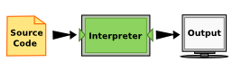
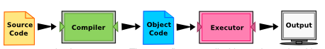

# introduction
Copyright © 2021 Theodore G. Cleveland and Farhang Forghanparast

Last GitHub Commit Date: 13 July 2021

- syllabus (link to course syllabus here; possibly include handout of document).  Use following syntax to imbed URL into notebook/markdown cell: `[link name to display](https://fqdn.filename.pdf)`
- computational thinking concepts
- jupyterlab/computing environment

---


## Computational Thinking Concepts

Computational thinking (CT) refers to the thought processes involved in expressing solutions as computational steps or algorithms that can be carried out by a computer. 

Much of what follows is borrowed from (https://www.ncbi.nlm.nih.gov/pmc/articles/PMC2696102/).

Computational thinking is taking an approach to solving problems, designing systems and understanding human behaviour that draws on concepts fundamental to computing (http://www.cs.cmu.edu/~15110-s13/Wing06-ct.pdf).

Computational thinking is a kind of analytical thinking:

- It shares with mathematical thinking in the general ways in which we might approach solving a problem. 
- It shares with engineering thinking in the general ways in which we might approach designing and evaluating a large, complex system that operates within the constraints of the real world. - It shares with scientific thinking in the general ways in which we might approach understanding computability, intelligence, the mind and human behaviour.

The essence of computational thinking is **abstraction** and **automation**. 
In computing, we abstract notions beyond the physical dimensions of time and space. Our abstractions are extremely general because they are symbolic, where numeric abstractions are just a special case.

### CT Foundations

CT is literally a process for breaking down a problem into smaller parts, looking for patterns in the problems, identifying what kind of information is needed, developing a step-by-step solution, and implementing that solution. 

1. Decomposition
2. Pattern Recognition
3. Abstraction
4. Algorithms
5. System Integration (implementation)

#### Decomposition
Decomposition is the process of taking a complex problem and breaking it into more manageable sub-problems. 

Decomposition often leaves a **framework** of sub-problems that later have to be **assembled (system integration)** to produce a desired solution.
 
#### Pattern Recognition
Refers to finding similarities, or shared characteristics of problems.  Allows a complex problem to become easier to solve. Allows use of same solution method for each occurrence of the pattern. 

Pattern recognition allows use of **automation** to process things - its a fundamental drilled shaft of CT.  It also provides a way to use analogs from old problems to address new situations; it also will require **assembly (system integration)** to produce a desired solution.

#### Abstraction

Determine important characteristics of the problem and ignore characteristics that are not important. Use these characteristics to create a representation of what we are trying to solve. 

Books in an online bookstore

|Important| NOT important| 
|:--------|:-------------|
|title    | Cover color  |
|ISBN     |Author’s hometown| 
|Authors  | ... |
|...      | ... |


#### Algorithms
Step-by-step instructions of how to solve a problem (https://en.wikipedia.org/wiki/Algorithm). 
Identifies what is to be done, and the order in which they should be done.


||Image from https://www.newyorker.com/magazine/2021/01/18/whats-wrong-with-the-way-we-work?utm_source=pocket-newtab||
|---|------------|---|

An algorithm is a **finite** sequence of defined, instructions, typically to solve a class of problems or to perform a computation. Algorithms are unambiguous and are used as specifications for performing calculations, data processing, automated reasoning, and other tasks. Starting from an initial state and initial input (perhaps empty), the instructions describe a computation that, when executed, proceeds through a finite number of defined successive states, eventually producing "output" and terminating at a final ending state. The transition from one state to the next is not necessarily deterministic; some algorithms, known as randomized algorithms, can incorporate random input.

#### System Integration (implementation)

System integration is the assembly of the parts above into the complete (integrated) solution.  Integration combines parts into a program which is the realization of an algorithm using a syntax that the computer can understand. 

## Data Science and Practice

Data science is leveraging existing data sources, to create new ones as needed in order to extract meaningful information and actionable insights through business domain expertise, effective communication and results interpretation. Data science uses relevant statistical techniques, programming languages, software packages and libraries, and data infrastructure; The insights are used to drive business decisions and take actions intended to achieve business goals. 

Why is this important for engineers? Because engineering is a business! 

A list of typical skills (https://elitedatascience.com/data-science-resources):

- Foundational Skills
    - **Programming and Data Manipulation** 
    - **Statistics and Probability**
- Technical Skills
    - Data Collection
    - SQL
    - **Data Visualization**
    - **Applied Machine Learning**
- Business Skills
    - **Communication**
    - Creativity and Innovation
    - Operations and Strategy
    - Business Analytics
- Supplementary Skills
    - Natural Language Processing
    - Recommendation Systems
    - **Time Series Analysis**
- Practice
    - **Projects**
    - Competitions
    - Problem Solving Challenges


## About JupyterLab (iPython) Environment

### The tools:
**JupyterLab** (https://jupyter.org/) is a web-based interactive development environment for Jupyter notebooks, code, and data. 

**Jupyter Notebook** is an open-source web application that allows you to create and share documents that contain live code, equations, visualizations and narrative text. Uses include: data organizing and transformation, numerical simulation, statistical modeling, visualization, machine learning, and other similar types of uses. 

**JupyterHub** (https://github.com/jupyterhub/jupyterhub) is a multi-user Hub that spawns, manages, and proxies multiple instances of the single-user Jupyter notebook server.

All these tools allow use of various coding languages; Python is the choice for ENGR 1330.  Installing JupyterLab on your own computer is relatively straightforward if it is an Intel-based Linux, Macintosh, or Windows machine - simply use Anaconda (https://www.anaconda.com/) as the installer.

Installing onto an ARM-based machine is more difficult, but possible (this notebook was created on a Raspberry Pi).  Chromebooks are the main example of ARM-based machines that may be difficult to use with Anaconda, but the it may be a non-issue by the time you read this sentance. 

### This course:

You will create and use Jupyter Notebooks that use the **ipython** kernel, the notebook files will look like `filename.ipynb`; these are ASCII files that the JupyterLab environment interprets and runs.

## About Python

The programming language we will use is Python (actually iPython). Python is an example of a high-level language; other high-level languages include C, C++, PHP, FORTRAN, ADA, Pascal, Go, Java, etc (there are a lot).

As you might infer from the name high-level language, there are also low-level languages, sometimes referred to as machine languages or assembly languages. Machine language is the encoding of instructions in binary so that they can be directly executed by the computer. Assembly language uses a slightly easier format to refer to the low level instructions. Loosely speaking, computers can only execute programs written in low-level languages. To be exact, computers can actually only execute programs written in machine language. Thus, programs written in a high-level language (and even those in assembly language) have to be processed before they can run. This extra processing takes some time, which is a small disadvantage of high-level languages. However, the advantages to high-level languages are enormous.

First, it is much easier to program in a high-level language. Programs written in a high-level language take less time to write, they are shorter and easier to read, and they are more likely to be correct. Second, high-level languages are portable, meaning that they can run on different kinds of computers with few or no modifications. Low-level programs can run on only one kind of computer and have to be rewritten to run on another.

Due to these advantages, almost all programs are written in high-level languages. Low-level languages are used only for a few specialized applications, and for device drivers.

Two kinds of programs process high-level languages into low-level languages: interpreters and compilers. An interpreter reads a high-level program and executes it, meaning that it does what the program says. It processes the program a little at a time, alternately reading lines and performing computations.



||Interpreted Program. Image from (https://runestone.academy/runestone/books/published/thinkcspy/GeneralIntro/ThePythonProgrammingLanguage.html)||
|---|------------|---|

A compiler reads the program and translates it completely before the program starts running. In this case, the high-level program is called the source code, and the translated program is called the object code or the executable. Once a program is compiled, you can execute it repeatedly without further translation.



||Compiled Program. Image from: (https://runestone.academy/runestone/books/published/thinkcspy/GeneralIntro/ThePythonProgrammingLanguage.html)||
|---|------------|---|

Many modern languages use both processes. They are first compiled into a lower level language, called byte code, and then interpreted by a program called a virtual machine. Python uses both processes, but because of the way programmers interact with it, it is usually considered an interpreted language.

As a language, python is a formal language that has certain requirements and structure called "syntax."

Formal languages are languages that are designed by people for specific applications. For example, the notation that mathematicians use is a formal language that is particularly good at denoting relationships among numbers and symbols. Chemists use a formal language to represent the chemical structure of molecules. Programming languages are formal languages that have been designed to express computations.

Formal languages have strict rules about syntax. For example, 3+3=6 is a syntactically correct mathematical statement, but 3=+6& is not. 

Syntax rules come in two flavors, pertaining to **tokens** and **structure**. **Tokens** are the basic elements of the language, such as words, numbers, and chemical elements. One of the problems with 3=+6& is that & is not a legal token in mathematics (at least as far as we know). 

The second type of syntax rule pertains to the structure of a statement— that is, the way the tokens are arranged. The statement 3=+6& is structurally illegal (in mathematics) because you don’t place a plus sign immediately after an equal sign (of course we will in python!). 

When you read a sentence in English or a statement in a formal language, you have to figure out what the structure of the sentence is; This process is called **parsing**.

For example, when you hear the sentence, “The other shoe fell”, you understand that the other shoe is the subject and fell is the verb. Once you have parsed a sentence, you can figure out what it means, or the semantics of the sentence. Assuming that you know what a shoe is and what it means to fall, you will understand the general implication of this sentence.

## Readings

Computational and Inferential Thinking Ani Adhikari and John DeNero, Computational and Inferential Thinking, The Foundations of Data Science, Creative Commons Attribution-NonCommercial-NoDerivatives 4.0 International (CC BY-NC-ND) Chapter 1 https://www.inferentialthinking.com/chapters/01/what-is-data-science.html

Learn Python the Hard Way (Online Book) (https://learnpythonthehardway.org/book/)  Recommended for beginners who want a complete course in programming with Python.

LearnPython.org (Interactive Tutorial) (https://www.learnpython.org/)  Short, interactive tutorial for those who just need a quick way to pick up Python syntax.

How to Think Like a Computer Scientist (Interactive Book) (https://runestone.academy/runestone/books/published/thinkcspy/index.html) Interactive "CS 101" course taught in Python that really focuses on the art of problem solving. 

How to Learn Python for Data Science, The Self-Starter Way (https://elitedatascience.com/learn-python-for-data-science) 


```python

```
