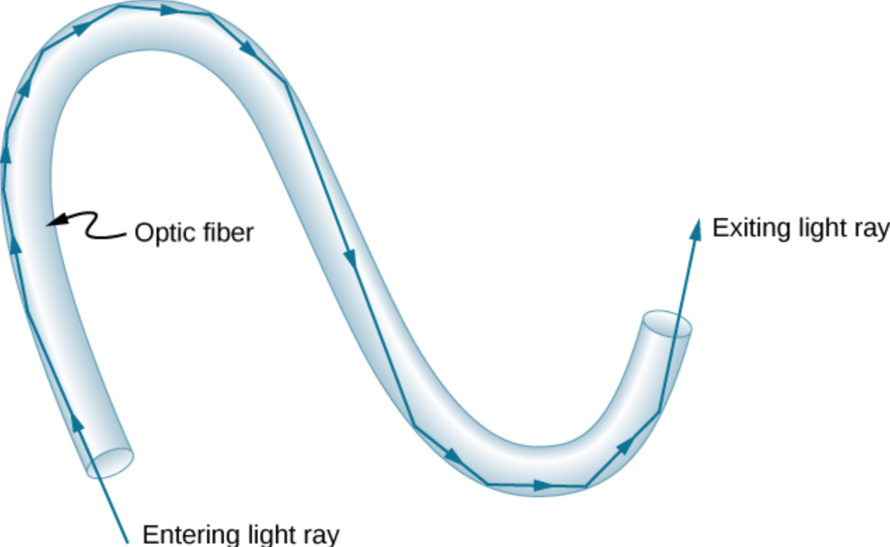
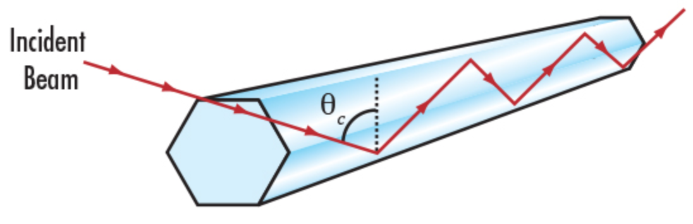

# Selection Structures

Decision making via conditional statements is an important building block in algorithm design; Selection is used to control the flow of execution of a program.

---
## Conditional Statements

Conditional statements in Python include:

- `if` statement
- `if....else` statements
- `if....elif....else` statements

Conditional statements are logical expressions that evaluate as TRUE or FALSE and using
these results to perform further operations based on these conditions.

Nearly all flow control in a program depends on evaluating conditions. 
The program will proceed
diferently based on the outcome of one or more conditions - really sophisticated AI programs are a collection of conditions and correlations. 

Expressed in a flowchart a block `if` statement looks like:


As psuedo code:

    if(condition is true): 
        do stuff

Amazon knowing what you want is based on correlations of your past behavior compared to other peoples similar, but more recent behavior, and then it uses conditional statements to decide what item to offer you in your recommendation items. 
It's a bit spooky, but ultimately just a program running in the background trying to make your money theirs.

### Comparison

The most common conditional operation is comparison. If we wish to compare whether two
variables are the same we use the `==` (double equal sign).

For example `x == y` means the program will ask whether x and y have the same value. 
If they do, the result is TRUE if not then the result is FALSE.

Other comparison signs are `!=` does NOT equal, `<` smaller than, `> `larger than, `<= `less than or equal, and `>=` greater than or equal.

There are also three logical operators when we want to build multiple compares
(multiple conditioning); these are `and`, `or`, and `not`.

The `and` operator returns TRUE if (and only if) **all** conditions are TRUE.
For instance `5 == 5 and 5 < 6` will return a TRUE because both conditions are true.

The `or` operator returns `TRUE` if at least one condition is true. 
If **all** conditions are FALSE, then it will return a FALSE. For instance `4 > 3 or 17 > 20 or 3 == 2` will return `TRUE` because the first condition is true.
The `not` operator returns `TRUE` if the condition after the `not` keyword is false. Think of it
as a way to do a logic reversal.


```python
# Examples
```

### Block `if` statement
The `if` statement is a common flow control statement. 
It allows the program to evaluate if a certain condition is satisfied and to perform a designed action based on the result of the evaluation. The structure of an `if` statement is

    if condition1 is met:
        do A
    elif condition 2 is met:
        do b
    elif condition 3 is met:
        do c
    else:
        do e
        
The `elif` means "else if". The `:` colon is an important part of the structure it tells where the action begins. Also there are no scope delimiters like (), or {} . 
Instead Python uses indentation to isolate blocks of code. 

This convention is hugely important - many other coding environments use delimiters (called scoping delimiters), but Python does not. The indentation itself is the scoping delimiter.


```python
# Examples
```

### Inline `if` statement
An inline `if` statement is a simpler form of an `if` statement and is more convenient if you
only need to perform a simple conditional task. 
The syntax is:

    do TaskA `if` condition is true `else` do TaskB
    

An example would be


```python
myInt = 3
num1 = 12 if myInt == 0 else 13
print(num1)
```

    13


An alternative way is to enclose the condition in brackets for some clarity like


```python
myInt = 3
num1 = 12 if (myInt == 0) else 13
print(num1)
```

    13


In either case the result is that `num1` will have the value `13` (unless you set myInt to 0).

## Example: Light Pipes

If light is directed into one end of a long glass or plastic rod the light is totally reflected by the walls bounging until it reaches the end of the rod.  Light pipes use this optical phenomenon to transmit light and even images from one place to another.  If one bends a light pipe the light can be coaxed to follow the pipe and curve around corners -- if the pipes are bundled into a collection of fibers mutiple signals can be sent down each fiber and these bundles are the main component of optical fiber communication and is schematized in the figure below.



The total internal reflection can be predicted using Snell's law and the indices of refraction of the fiber and jacket materials.  Usually the core material is selected with a high refractive index compared to the jacket (which may be just air).  When light passes from one material to another it is bent at the interface proportional to the refractive indices and the angle of incidence at the interface as in the sketch below



The angle of incidence where the light will reflect as opposed to crossing the interface is called the critical angle $\Theta_c$ and is subject to the formula:

$sin~\Theta_c = \frac{n_2}{n_1}$

where $n_1$ is the refractive index of the fiber core and $n_2$ is the refractive index of the jacket.

If the jacket has a higher refractive index than the core, the light pipe will not transmit light from one end to another regardless of the incidence angle.  If not, then any incidence angle greater than the critical angle (e.g. closer to the pipe entry axis) will sucessfully achieve internal reflection and transmit.

Suppose we wished to make a design tool to let designers evaluate different materials and determine if a particular material selection makes sense, and how small an angle will work (smaller means less precision is required at the entry/exit interface).  Lets apply the problem solving protocol, and a bit of computational thinking to develop a tool.

---

**Step 1 Problem Statement:** 
Determine whether a light pipe constructed of two materials will transmit light that enters the pipe at a prescribed angle

**Step 2 Input/Output/Governing Principles**
Inputs are the indices of refraction of the core ($n_1$) and jacket($n_2$) materials and the light incident angle at the pipe entrance ($\Theta_i$)

The governing equations are 

$\text{If}~\Theta_i > \Theta_c~\text{then light will propagate} $

and 

$sin~\Theta_c = \frac{n_2}{n_1}$


**Step 3 By-Hand Example**
Consider a core made of optical glass (without coatings) surrounded by air - a pipe without a jacket.
The [refraction index for air](https://www.google.com/search?client=firefox-b-1-d&q=refractive+index+of+air) is 1.0003.  The [index of refraction for glass](https://www.google.com/search?q=refractive+index+of+glass&client=firefox-b-1-d&ei=jVDzYJmNIca0tQaDgb_gAg&oq=refractive+index+of+glass&gs_lcp=Cgdnd3Mtd2l6EAMyBAgAEEMyAggAMgIIADICCAAyAggAMgIIADICCAAyAggAMgIIADICCAA6BwgAEEcQsAM6BwgAELADEENKBAhBGABQ8_kCWNyCA2CejANoAXACeACAAV2IAaQDkgEBNpgBAKABAaoBB2d3cy13aXrIAQrAAQE&sclient=gws-wiz&ved=0ahUKEwjZh4__iuvxAhVGWs0KHYPADywQ4dUDCA0&uact=5) is 1.52

The critical angle is 

$\Theta_c = sin^{-1}(\frac{1.0003}{1.52})= 41.15^o$

Thus the light pipe will transmit all light that enters at an angle greater than 41.15 degrees.

**Step 4 Algorithm Development**
The problem is decomposed as 

1. Read into the application the refraction indices $n_1$ and $n_2$ and the incidence angle relative to the core/jacket wall.
2. Determine if $n_2$ is larger than $n_1$, if true then no transmission
3. If transmission is possible, then compute critical angle
4. Determine if incident angle larger than critical angle, if true then transmission
5. Report result

As psuedocode:

- prompt user for n1,n2,angle
- if n2>n1 print no transmission else
- compute critical angle
- if incident angle > critical angle then print transmission
- else print no transmission

Below we convert psuedocode to python script
  


```python
# load the math library
import math
# prompt user for n1,n2,angle
print('Begin Light Pipe Design')
n1 = float(input('Enter RI of pipe core'))
n2 = float(input('Enter RI of pipe jacket'))
anglein = float(input('Enter incident angle of light (in degrees)'))
# if n2>n1 print no transmission else
if (n2>n1): # selection structure
    print('Light not transmitted, jacket material too dense')
else:
# compute critical angle
    critangle = math.degrees(math.asin(n2/n1)) #use math package for arcsine
# if incident angle > critical angle then print transmission
    if anglein > critangle:  # selection structure
        print('Light is transmitted')
# else print no transmission
    else:
        print('Light is not transmitted, adjust interface angle')
print('End Light Pipe Design')
```

    Begin Light Pipe Design


    Enter RI of pipe core 1.52
    Enter RI of pipe jacket 1.0003
    Enter incident angle of light (in degrees) 45


    Light is transmitted
    End Light Pipe Design


Now we have a tool and can evaluate a variety of material pairs to build a light pipe.  

|**Material**|**Index of Refraction**|
|---|---:|
|Hydrogen      (1 atm.;0C)|1.0001|
|Air           (1 atm.;0C)|1.0003|
|Carbon Dioxide(1 atm.;0C)|1.0005|
|Water               (20C)|1.333|
|Ethanol             (20C)|1.362|
|Glycerine           (20C)|1.473|
|Ice                      |1.31|
|Polystryene              |1.59|
|Crown Glass              |1.62|
|Borosilicate             |1.75|
|Carbon (Diamond)         |2.417|
|Acrylic                  |1.49|

**Step 5 Testing/Application**
Apply using acrylic in water


```python
# load the math library
import math
# prompt user for n1,n2,angle
print('Begin Light Pipe Design')
n1 = float(input('Enter RI of pipe core'))
n2 = float(input('Enter RI of pipe jacket'))
anglein = float(input('Enter incident angle of light (in degrees)'))
# if n2>n1 print no transmission else
if (n2>n1): # selection structure
    print('Light not transmitted, jacket material too dense')
else:
# compute critical angle
    critangle = math.degrees(math.asin(n2/n1)) #use math package for arcsine
# if incident angle > critical angle then print transmission
    if anglein > critangle:  # selection structure
        print('Light is transmitted')
# else print no transmission
    else:
        print('Light is not transmitted, adjust interface angle')
print('End Light Pipe Design')
```

    Begin Light Pipe Design


    Enter RI of pipe core 1.49
    Enter RI of pipe jacket 1.333
    Enter incident angle of light (in degrees) 45


    Light is not transmitted, adjust interface angle
    End Light Pipe Design


## Readings

1. Learn Python in One Day and Learn It Well. Python for Beginners with Hands-on Project. (Learn Coding Fast with Hands-On Project Book -- Kindle Edition by LCF Publishing (Author), Jamie Chan [https://www.amazon.com/Python-2nd-Beginners-Hands-Project-ebook/dp/B071Z2Q6TQ/ref=sr_1_3?dchild=1&keywords=learn+python+in+a+day&qid=1611108340&sr=8-3](https://www.amazon.com/Python-2nd-Beginners-Hands-Project-ebook/dp/B071Z2Q6TQ/ref=sr_1_3?dchild=1&keywords=learn+python+in+a+day&qid=1611108340&sr=8-3)

2. Learn Python the Hard Way (Online Book) (https://learnpythonthehardway.org/book/)  Recommended for beginners who want a complete course in programming with Python.

3. How to Learn Python for Data Science, The Self-Starter Way (https://elitedatascience.com/learn-python-for-data-science) 


```python

```
