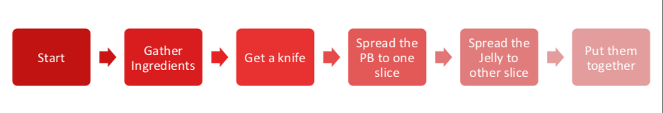

# Repetition Structures

The action of doing something over and over again (repetition) is called a loop - the name becomes apparent when we examine a flowchart representation of repetition.  Loops repeat a portion of code a finite number of times until a process is complete. Repetitive tasks are very common and essential in programming. They save time in coding, minimize coding errors, and leverage the speed of electronic computation.

## Loop Analogs
If you think any mass manufacturing process, we apply the same process again and again. Even for something very simple such as preparing a peanut butter sandwich:

Consider the ***flowchart*** in Figure 1, it represents a decomposition of sandwich assembly, but at a high level -- for instance, `Gather Ingredients` contains a lot of substeps that would need to be decomposed if fully automated assembly were to be accomplished; nevertheless lets stipulate that this flowchart will indeed construct a single sandwich.



|Figure 1|Supervisory Flowchart Sandwich Assembly (adapted from http://www.str-tn.org/subway_restaurant_training_manual.pdf) ||
|:---|:---|:---|

If we need to make 1000 peanut butter sandwichs we would then issue a directive to:

1) Implement sandwich assembly, repeat 999 times (repeat is the loop structure) (A serial structure, 1 sandwich artist, doing same job over and over again)

**OR**

2) Implement 1000 sandwich assembly threads (A parallel structure, 1000 sandwich artists doing same job once)

In general because we dont want to idle 999 sandwich artists, we would choose the serial structure, which frees 999 people to ask the existential question "would you like fries with that?"

All cynicism aside, an automated process such as a loop, is typical in computational processing. 

***Aside*** NVIDIA CUDA, and AMD OpenGL compilers can detect the structure above, and if there are enough GPU threads available , create the 1000 sandwich artists (1000 GPU threads), and run the process in parallel -- the actual workload is unchanged in a thermodynamic sense, but the apparent time (in human terms) spent in sandwich creation is a fraction of the serial approach.  This parallelization is called unrolling the loop, and is a pretty common optimization step during compilation. This kind of programming is outside the scope of this class.

Main attractiveness of loops is:
- Leveraging  `pattern matching` and `automation`
- Code is more organized and shorter,because a loop is a sequence of instructions that is continually repeated until a certain condition is reached. 

There are 2 main types loops based on the repetition control condition; `for` loops and `while`loops.

---


# Count controlled repetition `for` loop structure)
Count-controlled repetition is also called definite repetition because the number of repetitions is known before the loop begins executing. 
When we do not know in advance the number of times we want to execute a statement, we cannot use count-controlled repetition (`while` structure discussed later). 
In such an instance, we would use sentinel-controlled repetition. 

A count-controlled repetition will exit after running a certain number of times. 
The count is kept in a variable called an index or counter. 
When the index reaches a certain value (the loop bound) the loop will end. 

Count-controlled repetition requires

* control variable (or loop counter)
* initial value of the control variable
* increment (or decrement) by which the control variable is modified each iteration through the loop
* condition that tests for the final value of the control variable 

We can use both `for` and `while` loops, for count controlled repetition, but the `for` loop in combination with the `range()` function is more common.

### Structured `FOR` loop
We have seen the for loop already, but we will formally introduce it here. The `for` loop executes a block of code repeatedly until the condition in the `for` statement is no longer true.

### Looping through an iterable
An iterable is anything that can be looped over - typically a list, string, or tuple. 
The syntax for looping through an iterable is illustrated by an example.

First a generic syntax

    for a in iterable:
    print(a)
    
Notice our friends the colon `:` and the indentation.

#### The `range()` function to create an iterable

The `range(begin,end,increment)` function will create an iterable starting at a value of begin, in steps defined by increment (`begin += increment`), ending at `end`. 

So a generic syntax becomes

    for a in range(begin,end,increment):
    print(a)

The examples that follow are count-controlled repetition (increment skip if greater)

## Example `for` loops


```python
# sum numbers from 1 to n
howmany = int(input('Enter N'))
accumulator = 0.0
for i in range(1,howmany+1,1):
    accumulator = accumulator + float(i)
print( 'Sum from 1 to ',howmany, 'is %.3f' % accumulator  )
```

    Enter N 9


    Sum from 1 to  9 is 45.000


```python
# sum even numbers from 1 to n
howmany = int(input('Enter N'))
accumulator = 0.0
for i in range(1,howmany+1,1):
    if i%2 == 0:
        accumulator = accumulator + float(i)
print( 'Sum of Evens from 1 to ',howmany, 'is %.3f' % accumulator  )
```

    Enter N 9


    Sum of Evens from 1 to  9 is 20.000


```python
howmany = int(input('Enter N'))
linetoprint=''
for i in range(1,howmany+1,1):
    linetoprint=linetoprint + '*'
    print(linetoprint)
```

    Enter N 9


    *
    **
    ***
    ****
    *****
    ******
    *******
    ********
    *********


## Nested Repetition

Nested repetition is when a control structure is placed inside of the body or main part of another control structure.

#### `break` to exit out of a loop

Sometimes you may want to exit the loop when a certain condition different from the counting
condition is met. Perhaps you are looping through a list and want to exit when you find the
first element in the list that matches some criterion. The break keyword is useful for such
an operation.

For example run the following program:


```python
#
j = 0
for i in range(0,9,1):
    j += 2
    print ("i = ",i,"j = ",j)
    if j == 6:
        break   
```

    i =  0 j =  2
    i =  1 j =  4
    i =  2 j =  6


```python
j = 0
for i in range(0,5,1):
    j += 2
    print( "i = ",i,"j = ",j)
    if j == 7:
        break
```

    i =  0 j =  2
    i =  1 j =  4
    i =  2 j =  6
    i =  3 j =  8
    i =  4 j =  10


In the first case, the for loop only executes 3 times before the condition j == 6 is TRUE and the loop is exited. 
In the second case, j == 7 never happens so the loop completes all its anticipated traverses.

In both cases an `if` statement was used within a for loop. Such "mixed" control structures
are quite common (and pretty necessary). 
A `while` loop contained within a `for` loop, with several `if` statements would be very common and such a structure is called __nested control.__
There is typically an upper limit to nesting but the limit is pretty large - easily in the
hundreds. It depends on the language and the system architecture ; suffice to say it is not
a practical limit except possibly for general-domain AI applications.
<hr>

We can also do mundane activities and leverage loops, arithmetic, and format codes to make useful tables like


```python
import math # package that contains cosine
print("     Cosines     ")
print("   x   ","|"," cos(x) ")
print("--------|--------")
for i in range(0,157,1):
    x = float(i)*0.1
    print("%.3f" % x, "  |", " %.4f "  % math.cos(x)) # note the format code and the placeholder % and syntax 
```

         Cosines     
       x    |  cos(x) 
    --------|--------
    0.000   |  1.0000 
    0.100   |  0.9950 
    0.200   |  0.9801 
    0.300   |  0.9553 
    0.400   |  0.9211 
    0.500   |  0.8776 
    0.600   |  0.8253 
    0.700   |  0.7648 
    0.800   |  0.6967 
    0.900   |  0.6216 
    1.000   |  0.5403 
    1.100   |  0.4536 
    1.200   |  0.3624 
    1.300   |  0.2675 
    1.400   |  0.1700 
    1.500   |  0.0707 
    1.600   |  -0.0292 
    1.700   |  -0.1288 
    1.800   |  -0.2272 
    1.900   |  -0.3233 
    2.000   |  -0.4161 
    2.100   |  -0.5048 
    2.200   |  -0.5885 
    2.300   |  -0.6663 
    2.400   |  -0.7374 
    2.500   |  -0.8011 
    2.600   |  -0.8569 
    2.700   |  -0.9041 
    2.800   |  -0.9422 
    2.900   |  -0.9710 
    3.000   |  -0.9900 
    3.100   |  -0.9991 
    3.200   |  -0.9983 
    3.300   |  -0.9875 
    3.400   |  -0.9668 
    3.500   |  -0.9365 
    3.600   |  -0.8968 
    3.700   |  -0.8481 
    3.800   |  -0.7910 
    3.900   |  -0.7259 
    4.000   |  -0.6536 
    4.100   |  -0.5748 
    4.200   |  -0.4903 
    4.300   |  -0.4008 
    4.400   |  -0.3073 
    4.500   |  -0.2108 
    4.600   |  -0.1122 
    4.700   |  -0.0124 
    4.800   |  0.0875 
    4.900   |  0.1865 
    5.000   |  0.2837 
    5.100   |  0.3780 
    5.200   |  0.4685 
    5.300   |  0.5544 
    5.400   |  0.6347 
    5.500   |  0.7087 
    5.600   |  0.7756 
    5.700   |  0.8347 
    5.800   |  0.8855 
    5.900   |  0.9275 
    6.000   |  0.9602 
    6.100   |  0.9833 
    6.200   |  0.9965 
    6.300   |  0.9999 
    6.400   |  0.9932 
    6.500   |  0.9766 
    6.600   |  0.9502 
    6.700   |  0.9144 
    6.800   |  0.8694 
    6.900   |  0.8157 
    7.000   |  0.7539 
    7.100   |  0.6845 
    7.200   |  0.6084 
    7.300   |  0.5261 
    7.400   |  0.4385 
    7.500   |  0.3466 
    7.600   |  0.2513 
    7.700   |  0.1534 
    7.800   |  0.0540 
    7.900   |  -0.0460 
    8.000   |  -0.1455 
    8.100   |  -0.2435 
    8.200   |  -0.3392 
    8.300   |  -0.4314 
    8.400   |  -0.5193 
    8.500   |  -0.6020 
    8.600   |  -0.6787 
    8.700   |  -0.7486 
    8.800   |  -0.8111 
    8.900   |  -0.8654 
    9.000   |  -0.9111 
    9.100   |  -0.9477 
    9.200   |  -0.9748 
    9.300   |  -0.9922 
    9.400   |  -0.9997 
    9.500   |  -0.9972 
    9.600   |  -0.9847 
    9.700   |  -0.9624 
    9.800   |  -0.9304 
    9.900   |  -0.8892 
    10.000   |  -0.8391 
    10.100   |  -0.7806 
    10.200   |  -0.7143 
    10.300   |  -0.6408 
    10.400   |  -0.5610 
    10.500   |  -0.4755 
    10.600   |  -0.3853 
    10.700   |  -0.2913 
    10.800   |  -0.1943 
    10.900   |  -0.0954 
    11.000   |  0.0044 
    11.100   |  0.1042 
    11.200   |  0.2030 
    11.300   |  0.2997 
    11.400   |  0.3935 
    11.500   |  0.4833 
    11.600   |  0.5683 
    11.700   |  0.6476 
    11.800   |  0.7204 
    11.900   |  0.7861 
    12.000   |  0.8439 
    12.100   |  0.8932 
    12.200   |  0.9336 
    12.300   |  0.9647 
    12.400   |  0.9862 
    12.500   |  0.9978 
    12.600   |  0.9994 
    12.700   |  0.9911 
    12.800   |  0.9728 
    12.900   |  0.9449 
    13.000   |  0.9074 
    13.100   |  0.8610 
    13.200   |  0.8059 
    13.300   |  0.7427 
    13.400   |  0.6722 
    13.500   |  0.5949 
    13.600   |  0.5117 
    13.700   |  0.4234 
    13.800   |  0.3308 
    13.900   |  0.2349 
    14.000   |  0.1367 
    14.100   |  0.0372 
    14.200   |  -0.0628 
    14.300   |  -0.1621 
    14.400   |  -0.2598 
    14.500   |  -0.3549 
    14.600   |  -0.4465 
    14.700   |  -0.5336 
    14.800   |  -0.6154 
    14.900   |  -0.6910 
    15.000   |  -0.7597 
    15.100   |  -0.8208 
    15.200   |  -0.8737 
    15.300   |  -0.9179 
    15.400   |  -0.9530 
    15.500   |  -0.9785 
    15.600   |  -0.9942 


#### The `continue` statement
The continue instruction skips the block of code after it is executed for that iteration. 
It is
best illustrated by an example.


```python
j = 0
for i in range(0,5,1):
    j += 2
    print ("\n i = ", i , ", j = ", j) #here the \n is a newline command
    if j == 6:
        continue
    print(" this message will be skipped over if j = 6 ") # still within the loop, so the skip is implemented
```

    
     i =  0 , j =  2
     this message will be skipped over if j = 6 
    
     i =  1 , j =  4
     this message will be skipped over if j = 6 
    
     i =  2 , j =  6
    
     i =  3 , j =  8
     this message will be skipped over if j = 6 
    
     i =  4 , j =  10
     this message will be skipped over if j = 6 


## Readings

1. Learn Python in One Day and Learn It Well. Python for Beginners with Hands-on Project. (Learn Coding Fast with Hands-On Project Book -- Kindle Edition by LCF Publishing (Author), Jamie Chan [https://www.amazon.com/Python-2nd-Beginners-Hands-Project-ebook/dp/B071Z2Q6TQ/ref=sr_1_3?dchild=1&keywords=learn+python+in+a+day&qid=1611108340&sr=8-3](https://www.amazon.com/Python-2nd-Beginners-Hands-Project-ebook/dp/B071Z2Q6TQ/ref=sr_1_3?dchild=1&keywords=learn+python+in+a+day&qid=1611108340&sr=8-3)

2. Learn Python the Hard Way (Online Book) (https://learnpythonthehardway.org/book/)  Recommended for beginners who want a complete course in programming with Python.

3. How to Learn Python for Data Science, The Self-Starter Way (https://elitedatascience.com/learn-python-for-data-science) 

4. Flowcharts (QA/QC Perspective) [https://asq.org/quality-resources/flowchart](https://asq.org/quality-resources/flowchart)

5. Flowcharts - Wikipedia [https://en.wikipedia.org/wiki/Flowchart](https://en.wikipedia.org/wiki/Flowchart)

6. Psuedocode - Wikipedia [https://en.wikipedia.org/wiki/Pseudocode](https://en.wikipedia.org/wiki/Pseudocode)


```python

```
