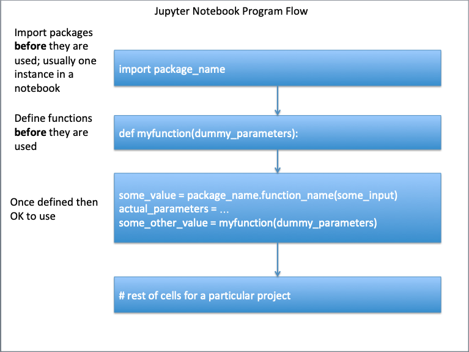
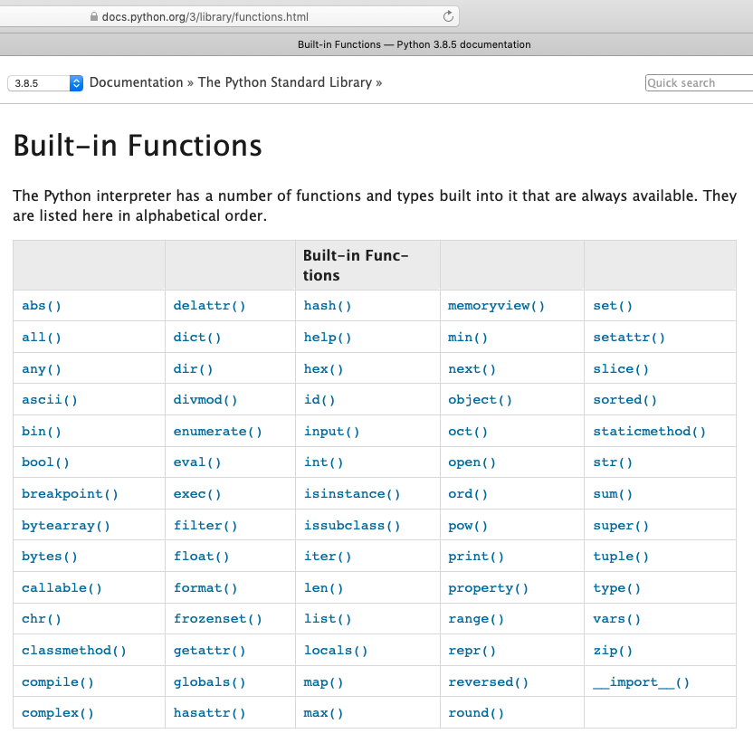

# Function
Functions are simply pre-written code fragments that perform a certain task. In older procedural languages functions and subroutines are similar, but a function returns a value whereas a subroutine operates on data. The difference is subtle but important. 

More recent thinking has functions being able to operate on data (they always could) and the value returned may be simply an exit code. An analogy are the functions in *MS Excel*. To add numbers, we can use the sum(range) function and type `=sum(A1:A5)` instead of typing `=A1+A2+A3+A4+A5`

## Calling the Function
We call a function simply by typing the name of the function or by using the dot notation.
Whether we can use the dot notation or not depends on how the function is written, whether it is part of a class, and how it is imported into a program.

Some functions expect us to pass data to them to perform their tasks. 
These data are known as parameters( older terminology is arguments, or argument list) and we pass them to the function by enclosing their values in parenthesis ( ) separated by commas. 

For instance, the `print()` function for displaying text on the screen is \called" by typing `print('Hello World')` where print is the name of the function and the literal (a string) 'Hello World' is the argument.

## Program flow
A function, whether built-in, or added must be defined *before* it is called, otherwise the script will fail.  Certain built-in functions "self define" upon start (such as `print()` and `type()` and we need not worry about those funtions).  The diagram below illustrates the requesite flow control for functions that need to be defined before use.



An example below  will illustrate, change the cell to code and run it, you should get an error.
Then fix the indicated line (remove the leading "#" in the import math ... line) and rerun, should get a functioning script.


```python
# reset the notebook using a magic function in JupyterLab
%reset -f 
# An example, run once as is then activate indicated line, run again - what happens?
x= 4.
sqrt_by_arithmetic = x**0.5
print('Using arithmetic square root of ', x, ' is ',sqrt_by_arithmetic )
import math # import the math package ## activate and rerun
sqrt_by_math = math.sqrt(x)  # note the dot notation
print('Using math package square root of ',  x,' is ',sqrt_by_arithmetic)
```

    Using arithmetic square root of  4.0  is  2.0
    Using math package square root of  4.0  is  2.0


An alternate way to load just the sqrt() function is shown below, either way is fine.


```python
# reset the notebook using a magic function in JupyterLab
%reset -f 
# An example, run once as is then activate indicated line, run again - what happens?
x= 4.
sqrt_by_arithmetic = x**0.5
print('Using arithmetic square root of ', x, ' is ',sqrt_by_arithmetic )
from math import sqrt # import sqrt from the math package ## activate and rerun
sqrt_by_math = sqrt(x)  # note the notation
print('Using math package square root of ',  x,' is ',sqrt_by_arithmetic)
```

    Using arithmetic square root of  4.0  is  2.0
    Using math package square root of  4.0  is  2.0


## Intrinsic (Built-in) in Base Python 

The base Python functions and types built into it that are always available, the figure below lists those functions.



Notice all have the structure of `function_name()`, except `__import__()` which has a constructor type structure, and is not intended for routine use.  We will learn about constructors later.


## Using External Packages/Modules and Libaries (e.g. math)

Python is also distributed with a large number of external functions. 
These functions are saved
in files known as modules. 
To use the built-in codes in Python modules, we have to import
them into our programs first. We do that by using the import keyword. 
There are three
ways to import:

1. Import the entire module by writing import moduleName; For instance, to import the random module, we write import random. To use the randrange() function in the random module, we write random.randrange( 1, 10);28
2. Import and rename the module by writing import random as r (where r is any name of your choice). Now to use the randrange() function, you simply write r.randrange(1, 10); and
3. Import specific functions from the module by writing from moduleName import name1[,name2[, ... nameN]]. For instance, to import the randrange() function from the random module, we write from random import randrange. To import multiple functions, we separate them with a comma. To import the randrange() and randint() functions, we write from random import randrange, randint. To use the function now, we do not have to use the dot notation anymore. Just write randrange( 1, 10).

A couple of usually available modules that install with base python are `math` and `array`.  Other modules we will use may need a separate system install (using pip or conda) are `numpy`, `pandas`, and `matplotlib`.  This notebook is created on a Raspberry Pi running a JupyterHub server, so these modules are installed using pip.  

If you build your environment using Anaconda, these modules should be available simply via `import`.


```python
# Example 1 of import
%reset -f 
import random
low = 1 ; high = 10
random.randrange(low,high) #generate random number in range low to high
```


    3


```python
# Example 2 of import
%reset -f 
import random as r #the alias r replaces random in subsequent calls
low = 1 ; high = 10
r.randrange(low,high)
```


    7


```python
# Example 3 of import
%reset -f 
from random import randrange # importing a single function from a module
low = 1 ; high = 10
randrange(low,high)
```


    6


The modules that come with Python are extensive and listed at 
https://docs.python.org/3/py-modindex.html.
There are also other modules that can be downloaded and used
(just like user defined modules below). 
In these labs we are building primitive codes to learn how to code and how to create algorithms. 
For many practical cases you will want to load a well-tested package to accomplish the tasks. 


## User-Built 
We can define our own functions in Python and reuse them throughout the program.
The syntax for defining a function is (the fragment below is psuedocode - it won't cut and paste!):

    def functionName( argument ):
        code detailing what the function should do
        note the colon above and indentation
        ...
        ...
        return [expression]
        
The keyword `def` tells the program that the indented code from the next line onwards is
part of the function. 
The keyword `return `tells the program to return an answer from the
function. 
There can be multiple return statements in a function. 
Once the function executes
a return statement, the program exits the function and continues with *its* next executable
statement. 
If the function does not need to return any value, you can omit the return
statement, but putting either null or exit code returns is good practice for code maintenance.

Functions can be pretty elaborate; they can search for things in a list, determine variable
types, open and close files, read and write to files. 

To get started we will build a few really
simple mathematical functions; we will need this skill in the future anyway, especially in
scientific programming contexts.

### User-built within a Code Block
For our first function we will code $$f(x) = x\sqrt{1 + x}$$ into a function named `dusty()`.

When you run the next cell, all it does is prototype the function (defines it), nothing happens until we use the function.


```python
def dusty(x) :
    temp = x * ((1.0+x)**(0.5)) # don't need the math package
    return temp
# the function should make the evaluation
# store in the local variable temp
# return contents of temp
```


```python
# wrapper to run the dusty function
yes = 0
while yes == 0:
    xvalue = input('enter a numeric value')
    try:
        xvalue = float(xvalue)
        yes = 1
    except:
        print('enter a bloody number! Try again \n')
# call the function, get value , write output
yvalue = dusty(xvalue)
print('f(',xvalue,') = ',yvalue) # and we are done 
```

    enter a numeric value 3


    f( 3.0 ) =  6.0


## Variable Scope
An important concept when defining a function is the concept of variable scope. 
Variables defined inside a function are treated differently from variables defined outside. 
Firstly, any variable declared within a function is only accessible within the function, unless explicitly defined otherwise (Google "python global variable" to learn more)
These are known as local variables. 

In the `dusty()` function, the variables `x` and `temp` are local to the function.
Any variable declared outside a function in a main program is known as a program variable
and is accessible anywhere in the main program, but not in functions unless supplied as a parameter. 

In the example, the variables `xvalue` and `yvalue` are program variables (accessible to the program; if they are passed to a function, they can be operated on.)
Generally we want to protect the program variables from the function unless the intent is to change their values. 
The way the function is written in the example, the function cannot damage `xvalue` or `yvalue`, but the contents of `xvalue` are operated on by the function and the results returned from `dusty` and stored in `yvalue`.

If a local variable shares the same name as a program variable, any code inside the function is
accessing the local variable. Any code outside is accessing the program variable


```python
def mercy(x) :
    temp = x * ((1.0+x)**(0.5)) # don't need the math package
    x = x+2
    print('Value of x in mercy is: ',x)
    return temp
```


```python
x = 2
y = mercy(x) 
print('Value of x in main  is: ',x,' Value of y is: ',y) # function did not change value of x in program
```

    Value of x in mercy is:  4
    Value of x in main  is:  2  Value of y is:  3.4641016151377544


```python

```

---

## Temperature Converter Example 

Create a Fahrenhiet to Celsius converter and test it for these values:

- 32
- 15
- 100

*hint: Formula-(°F − 32) × 5/9 = °C

### Problem Solving Process

#### Step 1
Define the problem (problem statement):
- Create a tool to convert Fahrenhiet to Celsius

#### Step 2
Gather information (identify known and unknown values, and governing equations)
- Known: Input in F
- Unknown: Output in C
- Governing Principles: *Formula: (°F − 32) × 5/9 = °C*

#### Step 3
Generate and evaluate potential solutions
- -40F = -40C
- 32F = 0C
- 212F = 100C

#### Step 4
Refine and implement a solution
1. Create function to evaluate input and produce output


```python
def FC(x) : # convert F to C
    C = (x - 32)*5/9
    return C
```

2. Create a wrapper supply input, execute function, label output


```python
print(FC(99))
```

    37.22222222222222


#### Step 5
Verify and test the solution.


```python
print(FC(-40))
```

    -40.0


```python
print(FC(32))
```

    0.0


```python
print(FC(212))
```

    100.0


#### Step 6
Refine to be useful
- Modify the wrapper to be interactive


```python
def F2C(x) : # convert F to C
    C = (x - 32)*5/9
    return C
# wrapper to run the F2C function
yes = 0
while yes == 0:
    xvalue = input('Enter a temperature in Fairyheight')
    try:
        xvalue = float(xvalue)
        yes = 1
    except:
        print('Enter a bloody number! Try again \n')
# call the function, get value , write output
yvalue = F2C(xvalue)
print('Temp: ',xvalue,'F = ',yvalue,' C') # and we are done 
```

    Enter a temperature in Fairyheight -40


    Temp:  -40.0 F =  -40.0  C


## References

1. Grus, Joel (2015-04-14). Data Science from Scratch: First Principles with Python
(Kindle Locations 1190-1191). O'Reilly Media. Kindle Edition. 

2. Call Expressions in "Adhikari, A. and DeNero, J. Computational and Inferential Thinking The Foundations of Data Science" https://www.inferentialthinking.com/chapters/03/3/Calls.html

3. Functions and Tables in "Adhikari, A. and DeNero, J. Computational and Inferential Thinking The Foundations of Data Science" https://www.inferentialthinking.com/chapters/08/Functions_and_Tables.html

4. Visualization in "Adhikari, A. and DeNero, J. Computational and Inferential Thinking The Foundations of Data Science" https://www.inferentialthinking.com/chapters/07/Visualization.html

5. Documentation; The Python Standard Library; 9. Numeric and Mathematical Modules https://docs.python.org/2/library/math.html

6. Code.org; Chris Bosh of Miami Heat and Jess Lee CEO of Polyvore. Let's use code to join Anna and Elsa as they explore the magic and beauty of ice. https://youtu.be/0eo0ESEX9DE

7. ENGR-1330 Functions and Variable Scope (Fall 2020) https://3.137.111.182/engr-1330-webroot/1-Lessons/Lesson05/OriginalPowerpoint/PythonFunctions-VariableScope-ENGR1330-CTwithDS.pdf
