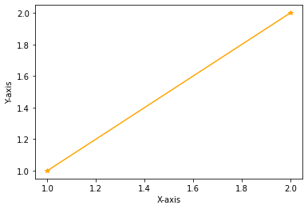

# External Modules
Modules, like functions are simply pre-written code fragments that perform a certain task. In older procedural languages modules and subroutines are similar concepts.

An external module, is just a file that contains python code, that is imported into your script, then run as if it was part of the script all along. Consider the following code cells - and read the comments


```python
! ls -l # list contents of current directory
```

    total 716
    -rw-rw-r-- 1 sensei sensei 122771 Jul 22 14:27 base-functions.png
    -rw-rw-r-- 1 sensei sensei 194845 Jul 22 14:27 external-file-import-Copy1.png
    -rw-rw-r-- 1 sensei sensei 194845 Jul 22 14:27 external-file-import.png
    -rw-rw-r-- 1 sensei sensei  72197 Jul 22 14:31 externalmodules.ipynb
    -rw-rw-r-- 1 sensei sensei 113349 Jul 22 14:27 flow-control-diagram.png
    -rw-rw-r-- 1 sensei sensei  17790 Jul 22 14:27 functions.md
    -rw-rw-r-- 1 sensei sensei   4066 Jul 22 14:27 index.html
    -rw-rw-r-- 1 sensei sensei    174 Jul 22 14:27 mylibrary.py


```python
! cat mylibrary.py # list contents of file named mylibrary.py
```

    def neko(input_argument) :
         import math #ok to import into a function
         local_variable = input_argument * math.sqrt(abs(1.0+input_argument))
         return local_variable


```python
import mylibrary # iPython assumes the extension .py
# wrapper to run the neko function
yes = 0
while yes == 0:
    xvalue = input('enter a numeric value')
    try:
        xvalue = float(xvalue)
        yes = 1
    except:
        print('enter a bloody number! Try again \n')
# call the function, get value , write output
yvalue = mylibrary.neko(xvalue) # here we call out external function
print('f(',xvalue,') = ',yvalue) # and we are done 
```

    enter a numeric value 2


    f( 2.0 ) =  3.4641016151377544


In JupyterHub environments, you may discover that changes you make to your external python file are not reflected when you re-run your script; you need to restart the kernel to get the changes to actually update. The figure below depicts the notebook, external file relatonship


This relationship is levereged when we build oor own libraries as illustrated next.

---


## Saving Code as a Separate Module/File

Above we imported the `neko()` function.

Here we will create a new function, export it to a file, so we can reuse it in later notebooks without having to retype or cut-and-paste. The `dusty()` function evaluates:

$$f(x) = x\sqrt{|(1 + x)|}$$

Its the same as the `neko()` function.

1. Create a text file named "mydusty.txt"
2. Copy the `dusty()` function script below into that file.

        def dusty(input_argument) :
            import math #ok to import into a function
            local_variable = input_argument * math.sqrt(abs(1.0+input_argument))
            return local_variable

**Note: the cells below we build the file directly on the server using bash (shell) commands; you would simply open the file in an editor and type the lines above. In lecture/lab we will use an editor to make the file**

4. rename `mydusty.txt` to `mydusty.py`  (This is a bit unnecessary, but if your editor gats confused, make a .txt file then rename after populated)
5. modify the wrapper script to use the dusty function as an external module


```python
! touch mydusty.txt # bash call to create an empty text file
```


```python
# bash calls to populate the file, you would normally use a text editor to create the file
! echo 'def dusty(input_argument) : ' > line1.txt
! echo '    import math #ok to import into a function'  > line2.txt
! echo '    local_variable = input_argument * math.sqrt(abs(1.0+input_argument))' > line3.txt
! echo '    return local_variable' > line4.txt
! cat line1.txt line2.txt line3.txt line4.txt > mydusty.txt # build mydusty
! rm -f line*.txt # remove the temp files
! mv mydusty.txt mydusty.py # rename the populated file
```


```python
# wrapper to run the dusty function
import mydusty
yes = 0
while yes == 0:
    xvalue = input('enter a numeric value')
    try:
        xvalue = float(xvalue)
        yes = 1
    except:
        print('enter a bloody number! Try again \n')
# call the function, get value , write output
yvalue = mydusty.dusty(xvalue)
print('f(',xvalue,') = ',yvalue) # and we are done 
```

    enter a numeric value 2


    f( 2.0 ) =  3.4641016151377544


---

## Temperature Converter Example (Repeated)

Create a Fahrenhiet to Celsius converter and test it for these values:

- 32
- 15
- 100

*hint: Formula-(°F − 32) × 5/9 = °C

### Problem Solving Process

#### Step 1
Define the problem (problem statement):
- Create a tool to convert Fahrenhiet to Celsius

#### Step 2
Gather information (identify known and unknown values, and governing equations)
- Known: Input in F
- Unknown: Output in C
- Governing Principles: *Formula: (°F − 32) × 5/9 = °C*

#### Step 3
Generate and evaluate potential solutions
- -40F = -40C
- 32F = 0C
- 212F = 100C

#### Step 4
Refine and implement a solution
1. Create function to evaluate input and produce output


```python
def FC(x) : # convert F to C
    C = (x - 32)*5/9
    return C
```

2. Create wrapper to prompt for input, execute function, label output


```python
print(FC(99))
```

    37.22222222222222


#### Step 5
Verify and test the solution.


```python
print(FC(-40))
```

    -40.0


```python
print(FC(32))
```

    0.0


```python
print(FC(212))
```

    100.0


#### Step 6
Refine to be useful
- Modify the wrapper to be interactive


```python
def F2C(x) : # convert F to C
    C = (x - 32)*5/9
    return C
# wrapper to run the F2C function
yes = 0
while yes == 0:
    xvalue = input('Enter a temperature in Fairyheight')
    try:
        xvalue = float(xvalue)
        yes = 1
    except:
        print('Enter a bloody number! Try again \n')
# call the function, get value , write output
yvalue = F2C(xvalue)
print('Temp: ',xvalue,'F = ',yvalue,' C') # and we are done 
```

    Enter a temperature in Fairyheight -40


    Temp:  -40.0 F =  -40.0  C


- Save the function into an external module "myConversions.py"


```python
# bash calls to populate the file, you would normally use a text editor to create the file
! echo 'def F2C(x) : # convert F to C' > line1.txt
! echo '    C = (x - 32)*5/9'          > line2.txt
! echo '    return C'                  > line3.txt
! cat line1.txt line2.txt line3.txt    > myConversions.py # build "myConversions.py"
! rm -f line*.txt # remove the temp files
```


```python
! cat myConversions.py # list contents of the file
```

    def F2C(x) : # convert F to C
        C = (x - 32)*5/9
        return C


```python
import myConversions
# wrapper to run the F2C function
yes = 0
while yes == 0:
    xvalue = input('Enter a temperature in Fairyheight')
    try:
        xvalue = float(xvalue)
        yes = 1
    except:
        print('Enter a bloody number! Try again \n')
# call the function, get value , write output
yvalue = myConversions.F2C(xvalue)
print('Temp: ',xvalue,'F = ',yvalue,' C') # and we are done 
```

    Enter a temperature in Fairyheight -40


    Temp:  -40.0 F =  -40.0  C


## Rudimentary Graphics

We can use external modules and function to make things other than strings and numbers for example consider making a script to that draws a straight line between two points and presents it as a plot.

The external module is named `matplotlib.pyplot` and is imported in the function body, then we prompt for vertex locations `(x1,y1)` and `(x2,y2)` then draw the plot.  Notice a null return statement which will return control to the main program.


```python
def drawAline():
    import matplotlib.pyplot  # import the plotting library from matplotlib
    x1 = int(input('Please enter x value for point 1'))
    y1 = int(input('Please enter y value for point 1'))
    x2 = int(input('Please enter x value for point 2'))
    y2 = int(input('Please enter y value for point 2'))
    xlist = [x1,x2]
    ylist = [y1,y2]
    matplotlib.pyplot.plot(xlist, ylist, color ='orange', marker ='*', linestyle ='solid') 
    #matplotlib.pyplot.title(strtitle)# add a title
    matplotlib.pyplot.ylabel("Y-axis")# add a label to the x and y-axes
    matplotlib.pyplot.xlabel("X-axis")
    matplotlib.pyplot.show() # display the plot
    return #null return
```


```python
drawAline()
```

    Please enter x value for point 1 1
    Please enter y value for point 1 1
    Please enter x value for point 2 2
    Please enter y value for point 2 2


    

    


Now lets put the plotting script into a function so we can make line charts of any two numeric lists

## References

1. Grus, Joel (2015-04-14). Data Science from Scratch: First Principles with Python
(Kindle Locations 1190-1191). O'Reilly Media. Kindle Edition. 

2. Call Expressions in "Adhikari, A. and DeNero, J. Computational and Inferential Thinking The Foundations of Data Science" https://www.inferentialthinking.com/chapters/03/3/Calls.html

3. Functions and Tables in "Adhikari, A. and DeNero, J. Computational and Inferential Thinking The Foundations of Data Science" https://www.inferentialthinking.com/chapters/08/Functions_and_Tables.html

4. Visualization in "Adhikari, A. and DeNero, J. Computational and Inferential Thinking The Foundations of Data Science" https://www.inferentialthinking.com/chapters/07/Visualization.html

5. Documentation; The Python Standard Library; 9. Numeric and Mathematical Modules https://docs.python.org/2/library/math.html


```python

```
