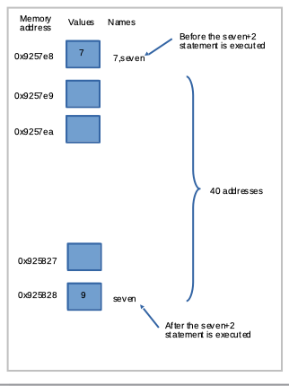

# Variables

Variables are names given to data that we want to store and manipulate in programs. A variable has a name and a value. The value representation depends on what type of object the variable represents. 
We have been calling these things containers, but variable is the more appropriate terminology.

The utility of variables comes in when we have a structure that is universal, but values of variables within the structure will change - otherwise it would be simple enough to use named constants (a container whose name is also its value, like 3 and 5.267).

Suppose we want to store the time of concentration for some hydrologic calculation. 
To do so, we can name a variable `TimeOfConcentration`, and then `assign` a value to the variable,
for instance:


```python
TimeOfConcentration = 0.0
```

After this assignment statement the variable is created in the program and has a value of 0.0. 
The use of a decimal point in the initial assignment establishes the variable as a float (a real variable is called a floating point representation -- or just a float).


```python
print(TimeOfConcentration)
```

    0.0


## Naming Rules

Variable names in Python can only contain letters (a - z, A - Z), numerals (0 - 9), or underscores. 
The first character cannot be a number, otherwise there is considerable freedom in naming. 
The names can be reasonably long. 
`runTime`, `run_Time`, `_run_Time2`, `_2runTime` are all valid names, but `2runTime` is not valid, and will create an error when you try to use it.


```python
# Script to illustrate variable names
runTime = 1
_2runTime = 2 # change to 2runTime = 2 and rerun script
runTime2 = 2
print(runTime,_2runTime,runTime2)
```

    1 2 2


There are some reserved words that cannot be used as variable names because they have preassigned meaning in Parseltongue. 
These words include `print`, `input`, `if`, `while`, and `for`. 
There are several more; the interpreter won't allow you to use these names as variables and will issue an error message when you attempt to run a program with such words used as variables.


```python
while = 72
print(while)
```


      File "<ipython-input-4-85c15d632191>", line 1
        while = 72
              ^
    SyntaxError: invalid syntax


## Variables in Expressions

Recall that expressions are the "algebraic" constructions that are evaluated and then placed into a variable.

Consider

    x1 = 7 + 3 * 6 / 2 - 1

The expression is evaluated from the left to right and in words is

    Into the object named x1 place the result of:
    
    integer 7 + (integer 6 divide by integer 2 = float 3 * integer 3 = float 9 - integer 1 = float 8) = float 15

The division operation by default produces a float result unless forced otherwise.  The result is the variable `x1` is a float with a value of `15.0`


```python
x1 = 7 + 3 * 6 / 2 - 1
print(x1)
```

    15.0


Suppose we want to replace the named constant 7 with a variable, simple enough, but now future changes need only be implemented once instead of every appearance of the named constant 7.  Here we are using a reset for a bit later on.


```python
%reset -f 
# use the reset so hex addresses in blocks below don't change when switching machines
seven = 7
x1 = seven + 3 * 6 / 2 - 1
print(x1)
```

    15.0


Why are they called named constants? Its a weird construct, but the name and the value are treated as the same thing, as depicted in the next few script blocks.  The last block prints virtual memory address locations of the variables - notice how `seven` and `7` have the same location - this is called equivalence, but look at what happens when you change `seven`


```python
7
print(7)
print(7, 'is type : ',type(7))
```

    7
    7 is type :  <class 'int'>


```python
7.7
print(7.7)
print(7.7, 'is type : ',type(7.7))
```

    7.7
    7.7 is type :  <class 'float'>


```python
print(hex(id(7)))
print(hex(id(7.7)))
print(hex(id(seven)))
seven = seven+2
print(hex(id(seven)))
```

    0x9257e8
    0xffffa9fe0ef0
    0x9257e8
    0x925828


So assuming the memory locations are approximately sequential then "7" and "seven" start out at the same location, but after execution of seven=seven+2 the result is stored about 40 addresses away as shown:



# Readings

1. Learn Python the Hard Way (Online Book) (https://learnpythonthehardway.org/book/)  Recommended for beginners who want a complete course in programming with Python.

2. LearnPython.org (Interactive Tutorial) (https://www.learnpython.org/)  Short, interactive tutorial for those who just need a quick way to pick up Python syntax.

3. How to Think Like a Computer Scientist (Interactive Book) (https://runestone.academy/runestone/books/published/thinkcspy/index.html) Interactive "CS 101" course taught in Python that really focuses on the art of problem solving. 

4. How to Learn Python for Data Science, The Self-Starter Way (https://elitedatascience.com/learn-python-for-data-science) 

5. Reverse lookup contents of a memory address [https://stackoverflow.com/questions/8250625/access-memory-address-in-pytho](https://stackoverflow.com/questions/8250625/access-memory-address-in-python)

6. Finding memory address [https://www.codespeedy.com/find-the-memory-address-of-a-variable-in-python/](https://www.codespeedy.com/find-the-memory-address-of-a-variable-in-python/)


```python

```
