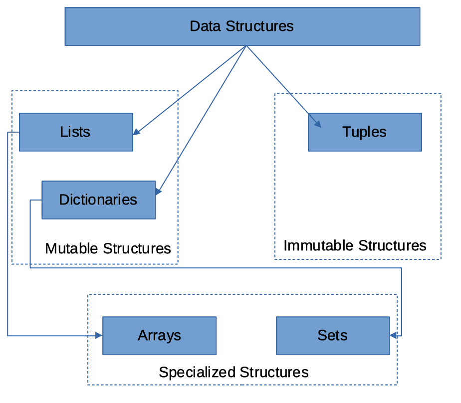
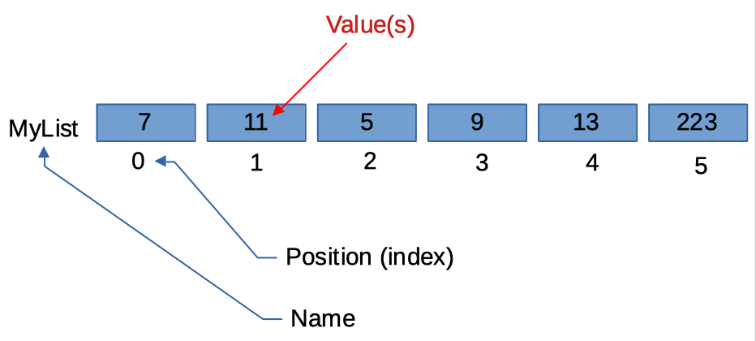

# Mutable Data Structures

## What is a data structure?

Data Structures are a specialized means of organizing and storing data in computers in such a way that we can perform operations on the stored data more effectively, and maintain the program easier.

In our iPython world the most common structures are illustrated in the figure below; here we are interested primarily in lists and dictionaries; the array structure is a special type of list that is explored later on, and the set is a special type of dictionary. Tuples are immutable, so are also left for later.



## What is mutable?

A definition from https://www.dictionary.com/browse/mutable is

mutable [ myoo-tuh-buhl ]

See synonyms for: mutable / mutability on [https://www.thesaurus.com/](https://www.thesaurus.com/)

adjective

1. liable or subject to change or alteration.
2. given to changing; constantly changing; fickle or inconstant: the mutable ways of fortune.
3. Computers. (in object-oriented programming) of or noting an object having properties whose values can change while the object itself maintains a unique identity.

The last definition is the one we seek, a mutable structure can have changing contents but the structure itself maintains identity.

A named constant `7` which we cannot change, is immutable, but a variable like `seven` which can change is in contrast, mutable.

## Lists

A list is a collection of data that are somehow related. It is a convenient way to refer to a
collection of similar things by a single name, and using an index (like a subscript in math)
to identify a particular item.

Consider the "math-like" variable $x$ below:

\begin{gather}
x_0= 7 \\
x_1= 11 \\
x_2= 5 \\
x_3= 9 \\
x_4= 13 \\
x_5= 223 \\
\end{gather}
    
The variable name is $x$ and the subscripts correspond to different values. 
Thus the `value` of the variable named $x$ associated with subscript $3$ is the number $9$.  
In our scripts the concept of subscript is replaced by a position or index, but it performs the same role - it identifies the particular container in the list, and lets us access the contents of the container. 

The figure below is a visual representation of a the concept that treats a variable as a collection of cells. 



In the figure, the variable name is `MyList`, the subscripts are replaced by a position (index) indicator
that identifies which cell is being referenced. 
The value is the cell content at the particular index. 

So in the figure the value of `MyList` at Position Index = 3 is the number 9.'

In engineering and data science we use lists a lot - we often call then vectors, arrays, matrices and such, but they are ultimately just lists.

To declare a list you can write the list name and assign it values. 
The square brackets are used to identify that the variable is a list. 
Like:


```python
%reset -f
```


```python
MyList = [7,11,5,9,13,223]
print(MyList)
```

    [7, 11, 5, 9, 13, 223]


One can also declare a null list and use the `append()` method to fill it as needed.


```python
MyOtherList = [ ]
print(MyOtherList)
MyOtherList.append(1)
print(MyOtherList)
MyOtherList.append(2)
print(MyOtherList)
```

    []
    [1]
    [1, 2]


Python indices start at **ZERO**. 
A lot of other languages start at ONE. 
It's just the convention. 

The first element in a list has an index of 0, the second an index of 1, and so on.
We access the contents of a list by referring to its name and index. 
For example 


```python
print(MyList[0])
print(MyList[3])
```

    7
    9


Lists can store elements of different data types

- Ordered: Elements in a list can be indexed
- Mutable: Elements in a list can be altered
- Mathematical	operations	must be applied	to	each element	of	the	list	

## Dictionary - A special kind of list

A dictionary is a special kind of list where the items are related data `PAIRS`. 
It is a lot like a relational database (it probably is one in fact) where the first item in the pair is called the key, and must be unique in a dictionary, and the second item in the pair is the data.
The second item could itself be a list, so a dictionary would be a meaningful way to build a
database in Python.

To declare a dictionary using `curly` brackets

    MyPetsNamesAndMass = { "Dusty":7.8 , "Aspen":6.3, "Merrimee":0.03}

To declare a dictionary using the `dict()` method

    MyPetsNamesAndMassToo = dict(Dusty = 7.8 , Aspen = 6.3, Merrimee = 0.03)
    
Dictionary properties

- Unordered: Elements in a dictionary are not indexed (address by their key)
- Mutable elements: Elements themselves in a dictionary can be altered
- Immutable keys: Keys in a dictionary cannot be altered

## Readings

1. Learn Python in One Day and Learn It Well. Python for Beginners with Hands-on Project. (Learn Coding Fast with Hands-On Project Book -- Kindle Edition by LCF Publishing (Author), Jamie Chan [https://www.amazon.com/Python-2nd-Beginners-Hands-Project-ebook/dp/B071Z2Q6TQ/ref=sr_1_3?dchild=1&keywords=learn+python+in+a+day&qid=1611108340&sr=8-3](https://www.amazon.com/Python-2nd-Beginners-Hands-Project-ebook/dp/B071Z2Q6TQ/ref=sr_1_3?dchild=1&keywords=learn+python+in+a+day&qid=1611108340&sr=8-3)

2. Learn Python the Hard Way (Online Book) (https://learnpythonthehardway.org/book/)  Recommended for beginners who want a complete course in programming with Python.

3. How to Learn Python for Data Science, The Self-Starter Way (https://elitedatascience.com/learn-python-for-data-science) 


```python

```
