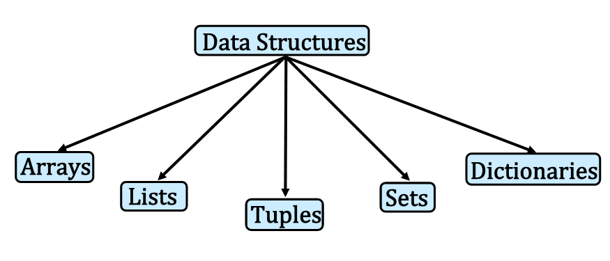

# Immutable Data Structures

Data Structures are a specialized means of organizing and storing data in computers in such a way that we can perform operations on the stored data more effectively, and maintain the program easier.

Here we are interested in tuples, which are [immutable](https://www.dictionary.com/browse/mutable), but quite useful.




## Tuple - A special list

A tuple is a special kind of list where the **values cannot be changed** after the list is created.
Such a property is called `immutable`
It is useful for list-like things that are static - like days in a week, or months of a year.
You declare a tuple like a list, except use round brackets instead of square brackets.


```python
MyTupleName = ("Jan","Feb","Mar","Apr","May","Jun","Jul","Aug","Sep","Oct","Nov","Dec")
print(MyTupleName)
```

    ('Jan', 'Feb', 'Mar', 'Apr', 'May', 'Jun', 'Jul', 'Aug', 'Sep', 'Oct', 'Nov', 'Dec')


Tuples are often created as output from packages and functions, so often when using other's work you have to detect tupality and modify your script accordingly.
 
You access the individual values of a tuple using their indexes, just like with a list.  


```python
print(MyTupleName[0])
print(MyTupleName[-1])
```

    Jan
    Dec


Tuples can be leveraged using a concatenation type operation and a multiply (better to call it a repeat) operator as:


```python
print(MyTupleName + ('duodec','symjan')) # add to a tuple 
print(MyTupleName[0:3]*2) #repeat a tuple
'Dec' in MyTupleName # query a tuple - for  whole entry
```

    ('Jan', 'Feb', 'Mar', 'Apr', 'May', 'Jun', 'Jul', 'Aug', 'Sep', 'Oct', 'Nov', 'Dec', 'duodec', 'symjan')
    ('Jan', 'Feb', 'Mar', 'Jan', 'Feb', 'Mar')


    True


## Special Structures: Sets 
Sets are used to store elements of different data types, they are similar to dictionaries with keys but no values (or the keys are the values)

- Unordered: Elements in a set cannot be indexed
- Mutable: Elements in a set can be altered
- Non-repetition: Elements in a set are unique

Elements of a set are enclosed in curly brackets { } or created using the set() method.

- Creating sets that contains different data types
- Sets cannot be nested


```python
myset = {1:'one',2:'two',3:{1:'one',2:'two',3:'seven of nine'}}
type(myset)
```


    dict


```python
(myset.get(3)).get(3) # get element from key 3 of key 3 set
```


    'seven of nine'


```python
myset = {1,2,77}
type(myset)
```


    set


```python
urset={'apple','cat','rock',77,'sunset strip'}
type(urset)
```


    set


```python
# union (join) sets
print('union is : ' ,myset | urset)
# intersection of sets (shared elements)
print('intersection is : ' ,myset & urset)
```

    union is :  {1, 2, 'apple', 'cat', 'sunset strip', 77, 'rock'}
    intersection is :  {77}


A good tutorial on sets and their use in python is [https://realpython.com/python-sets/](https://realpython.com/python-sets/)

#### What's the difference between a set and dictionary? 

From [https://stackoverflow.com/questions/34370599/difference-between-dict-and-set-python](https://stackoverflow.com/questions/34370599/difference-between-dict-and-set-python)

"Well, a set is like a dict with keys but no values, and they're both implemented using a hash table. But yes, it's a little annoying that the `{}` notation denotes an empty `dict` rather than an empty `set`, but that's a historical artifact."

## Special Structures: Arrays 

Arrays are lists that are used to store only elements of a specific data type

-  Ordered: Elements in an array can be indexed
-  Mutable: Elements in an array can be altered


Data type that an array must hold is specified using the type code when it is created
- ‘f’ for float
- ‘d’ for double
- ‘i’ for signed int
- ‘I’ for unsigned int

More types are listed below


|Type Code|C Data Type|Python Data Type|Minimum Size in Bytes|
|:---|---|---|---:|
|'b'|	signed char|int	|1|
|'B'|	unsigned char	|int	|1|
|'h'|	signed short	|int	|2|
|'H'|	unsigned short	|int	|2|
|'i'|	signed int	|int	|2|
|'I'|	unsigned int	|int	|2|
|'l'|	signed long	|int	|4|
|'L'|	unsigned long	|int	|4|
|'q'|	signed long long	|int	|8|
|'Q'|	unsigned long long	|int	|8|
|'f'|	float	|float	|4|
|'d'|	double	|float	|8|

To use arrays, a library named ‘array’ must be imported (the library installs as part of core, so usually just an import is required)


```python
import array 
```

Creating an array that contains signed integer numbers


```python
myarray = array.array('i', [1, 2, 4, 8, 16, 32])
```


```python
myarray[0] #1-st element, 0-th position
```


    1


Higher dimensional arrays (matrices) require a constructor type assembly, which is presented later. The numpy module simplifies higher dimensional array construction and is probably used the most.

## Readings

1. Learn Python in One Day and Learn It Well. Python for Beginners with Hands-on Project. (Learn Coding Fast with Hands-On Project Book -- Kindle Edition by LCF Publishing (Author), Jamie Chan [https://www.amazon.com/Python-2nd-Beginners-Hands-Project-ebook/dp/B071Z2Q6TQ/ref=sr_1_3?dchild=1&keywords=learn+python+in+a+day&qid=1611108340&sr=8-3](https://www.amazon.com/Python-2nd-Beginners-Hands-Project-ebook/dp/B071Z2Q6TQ/ref=sr_1_3?dchild=1&keywords=learn+python+in+a+day&qid=1611108340&sr=8-3)

2. Learn Python the Hard Way (Online Book) (https://learnpythonthehardway.org/book/)  Recommended for beginners who want a complete course in programming with Python.

3. How to Learn Python for Data Science, The Self-Starter Way (https://elitedatascience.com/learn-python-for-data-science) 

4. Sets (tutorial) [https://realpython.com/python-sets/](https://realpython.com/python-sets/)

5. Arrays (tutorial) [https://www.geeksforgeeks.org/python-using-2d-arrays-lists-the-right-way/](https://www.geeksforgeeks.org/python-using-2d-arrays-lists-the-right-way/)


```python

```
